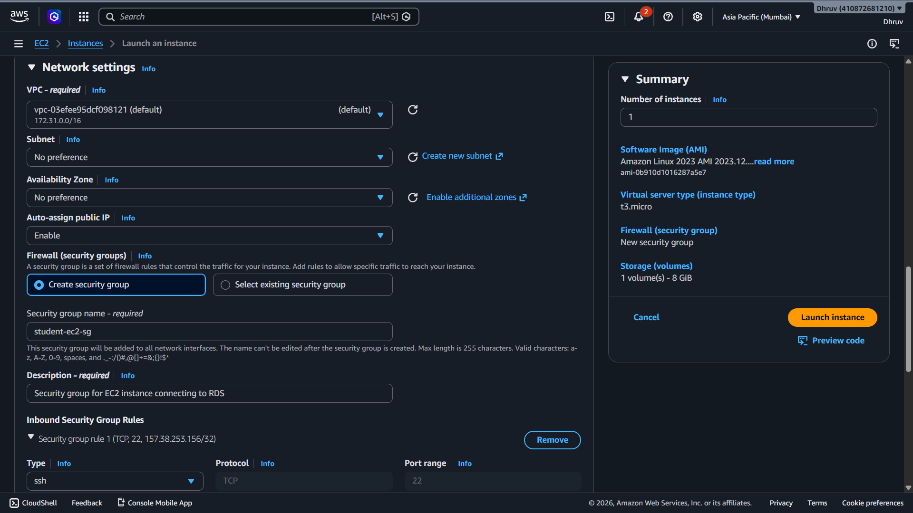
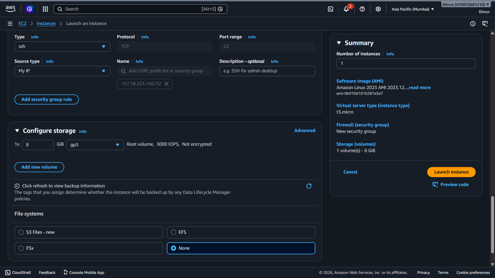
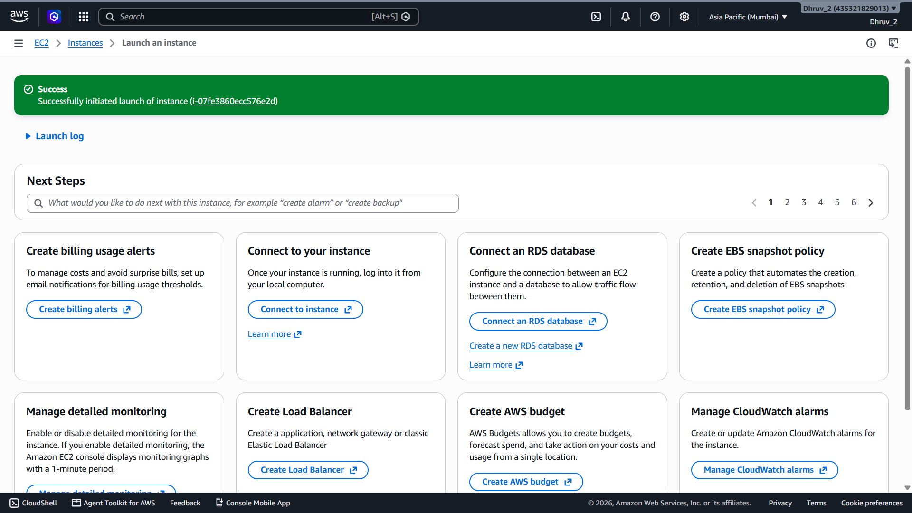
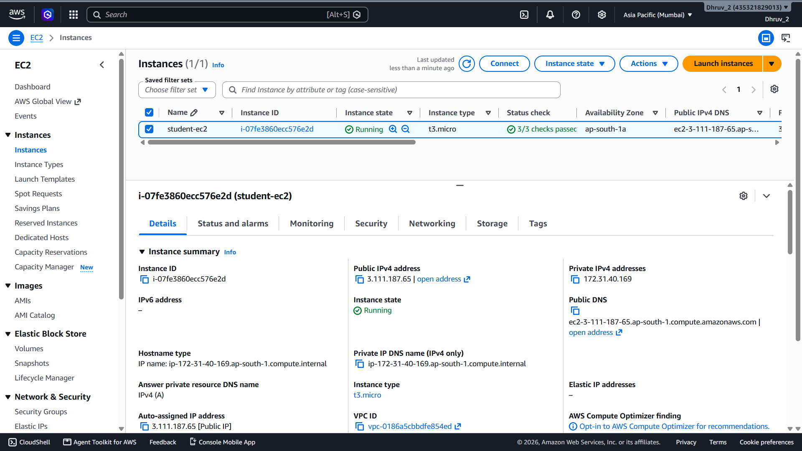

# 🚀 Launch EC2 Instance

---

# 📖 Overview

In this milestone, an Amazon EC2 instance was launched to act as the client machine for connecting securely to the Amazon RDS MySQL database in later stages of the project.

The EC2 instance serves as the application server from which MySQL commands will be executed after the RDS database is created.

---

# 🎯 Objective

The objective of this milestone was to:

- Launch an Amazon EC2 instance
- Configure networking and security settings
- Enable secure SSH access
- Prepare the environment for connecting to Amazon RDS

---

# ⚙️ EC2 Configuration

| Property | Value |
|----------|-------|
| Instance Name | student-ec2 |
| Region | ap-south-1 (Mumbai) |
| AMI | Amazon Linux 2023 |
| Instance Type | t3.micro |
| VPC | Default VPC |
| Public IP | Enabled |
| Security Group | student-ec2-sg |
| SSH Access | My IP |
| Root Volume | 8 GB gp3 |

---

# 🏗️ Implementation Steps

## Step 1

Opened the **Amazon EC2 Console**.

---

## Step 2

Clicked **Launch Instance**.

---

## Step 3

Configured the EC2 instance.

- Name: **student-ec2**
- AMI: **Amazon Linux 2023**
- Instance Type: **t3.micro**
- Existing Key Pair selected
- Default VPC used

---

## Step 4

Created a new Security Group.

Configuration:

- Security Group Name: **student-ec2-sg**
- SSH Access: **My IP only**

This ensures that only the current machine can access the EC2 instance using SSH.

---

## Step 5

Configured storage.

- Root Volume: **8 GB**
- Volume Type: **gp3**

---

## Step 6

Reviewed the configuration and launched the EC2 instance.

The instance was successfully created and entered the **Running** state.

---

# ✅ Result

The EC2 instance was launched successfully and is now ready for the next milestone, where it will be used to establish a secure connection with the Amazon RDS MySQL database.

---

# 📷 Screenshots

### EC2 Launch Configuration

---

### Instance Configuration

---

### Network Settings

---

### Storage Configuration

---

### Successful Launch

---

### Running EC2 Instance

---

# 🚀 Next Step

The next milestone is to create the networking components required for Amazon RDS.

This includes:

- Creating the RDS Security Group
- Creating the RDS Subnet Group
- Preparing the networking configuration for the MySQL database instance
