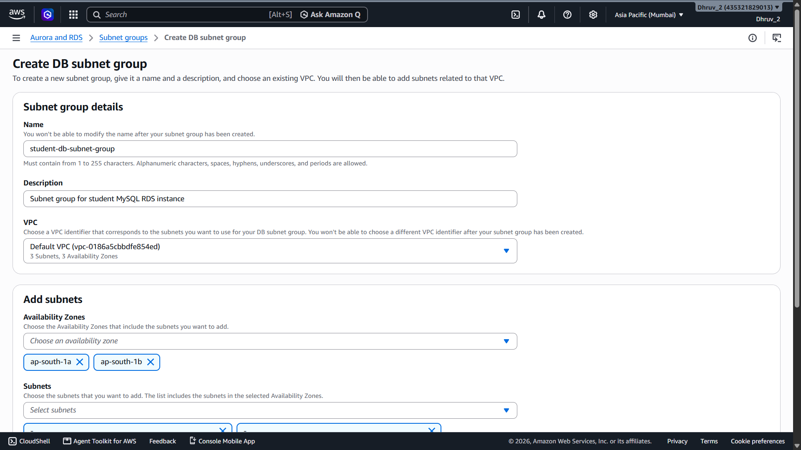
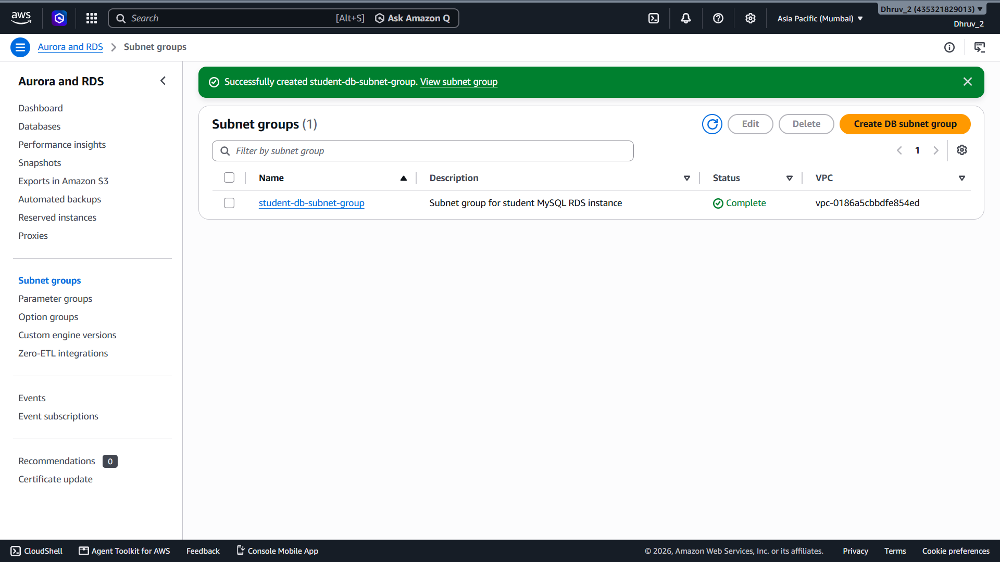
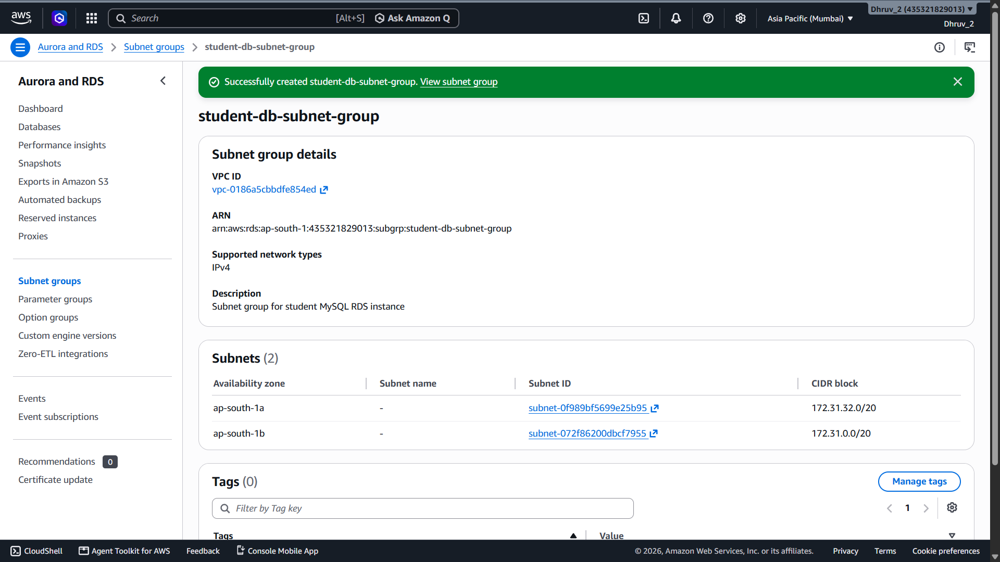

# 04 - Create DB Subnet Group

## Overview

A DB Subnet Group was created to define the network locations (subnets) where the Amazon RDS MySQL instance can be deployed.

The subnet group ensures that the database is launched inside the selected VPC and spans multiple Availability Zones, improving availability and fault tolerance.

---

## Objective

Create a DB Subnet Group that will later be attached to the Amazon RDS MySQL instance.

---

## Configuration

| Setting | Value |
|----------|-------|
| DB Subnet Group Name | student-db-subnet-group |
| Description | Subnet group for student MySQL RDS instance |
| VPC | Default VPC |
| Availability Zones | ap-south-1a, ap-south-1b |
| Selected Subnets | 2 (One from each Availability Zone) |

---

## Steps Performed

1. Opened the **Amazon RDS Console**.
2. Navigated to **Subnet Groups**.
3. Clicked **Create DB Subnet Group**.
4. Entered the subnet group name.
5. Added a meaningful description.
6. Selected the default VPC.
7. Selected two Availability Zones.
8. Chose one subnet from each Availability Zone.
9. Reviewed the configuration.
10. Clicked **Create**.
11. Verified that the DB Subnet Group was successfully created.

---

## Why a DB Subnet Group is Required

A DB Subnet Group specifies the subnets where Amazon RDS is allowed to launch database instances.

It provides:

- Controlled network placement inside a VPC.
- High availability by allowing deployment across multiple Availability Zones.
- Isolation from public internet access (when private subnets are used).
- A prerequisite for launching an Amazon RDS instance inside a VPC.

Without a DB Subnet Group, Amazon RDS cannot determine which subnets should host the database.

---

## Architecture Impact

After completing this step, the project infrastructure includes:

- Amazon EC2 Instance
- EC2 Security Group
- Amazon RDS Security Group
- Amazon RDS DB Subnet Group

The DB Subnet Group will be selected while creating the MySQL RDS instance in the next milestone.

---

## Screenshots

### 1. DB Subnet Group Configuration

Shows the initial configuration, including the subnet group name, description, and selected VPC.

---

### 2. Selected Availability Zones and Subnets

Shows the Availability Zones and subnets selected for the DB Subnet Group before creation.

---

### 3. DB Subnet Group Created Successfully

Shows the successful creation of the DB Subnet Group.

---

### 4. DB Subnet Group Details

Displays the final configuration of the DB Subnet Group, including the selected subnets and VPC information.

