# 05 - Create Amazon RDS MySQL Instance

## Overview

An Amazon RDS MySQL instance was created to provide a fully managed relational database service for the project.

The database was deployed inside the selected VPC using the previously created DB Subnet Group and secured using a dedicated RDS Security Group. Public access was disabled to ensure that the database can only be accessed from authorized resources within the VPC.

---

## Objective

Create a private Amazon RDS MySQL instance that can be securely accessed from the EC2 instance.

---

## Configuration

| Setting | Value |
|----------|-------|
| Engine | MySQL Community |
| Template | Free Tier |
| DB Identifier | student-db |
| Engine Version | MySQL 8.4.9 |
| Master Username | admin |
| Instance Class | db.t3.micro |
| Storage Type | General Purpose SSD (gp2) |
| Allocated Storage | 20 GiB |
| VPC | Default VPC |
| DB Subnet Group | student-db-subnet-group |
| Public Access | No |
| Security Group | student-rds-sg |
| Availability | Single-AZ |

---

## Steps Performed

1. Opened the **Amazon RDS Console**.
2. Clicked **Create Database**.
3. Selected **MySQL Community Edition**.
4. Chose the **Free Tier** template.
5. Entered the database identifier **student-db**.
6. Configured the master username and password.
7. Selected the **db.t3.micro** instance class.
8. Configured 20 GiB General Purpose SSD storage.
9. Selected the project VPC.
10. Selected the previously created **DB Subnet Group**.
11. Disabled **Public Access**.
12. Attached the **student-rds-sg** security group.
13. Reviewed the configuration.
14. Clicked **Create Database**.
15. Waited until the database status changed to **Available**.
16. Opened the **Connectivity & Security** tab and copied the RDS endpoint.
17. Installed the MySQL (MariaDB) client on the EC2 instance.
18. Connected successfully from the EC2 instance to the RDS database using the endpoint.

---

## Why Amazon RDS is Required

Amazon RDS provides a fully managed relational database without requiring manual installation, patching, backups, or infrastructure management.

It provides:

- Fully managed MySQL database service.
- Automatic backups and maintenance.
- Secure deployment inside a VPC.
- High availability and scalability.
- Secure connectivity using Security Groups.
- Easy integration with EC2 applications.

Using Amazon RDS allows applications running on EC2 to store and retrieve relational data securely without managing database servers manually.

---

## Architecture Impact

After completing this step, the project infrastructure includes:

- Amazon EC2 Instance
- EC2 Security Group
- Amazon RDS Security Group
- Amazon RDS DB Subnet Group
- Amazon RDS MySQL Instance

The EC2 instance can now securely communicate with the private MySQL database over port **3306**.

---

## Screenshots

### 1. Engine Selection and Database Creation Method

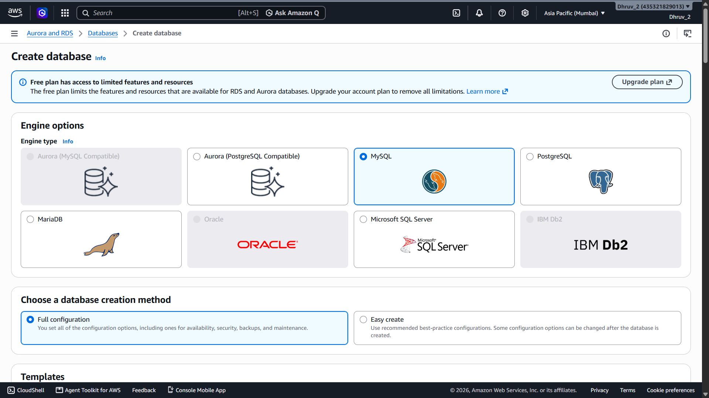

---

### 2. Free Tier Template and Deployment Options

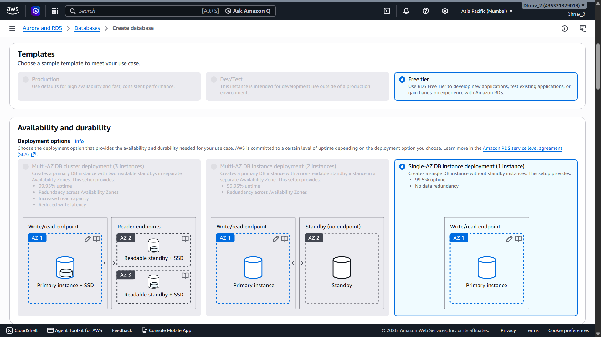

---

### 3. Database Identifier and Credentials

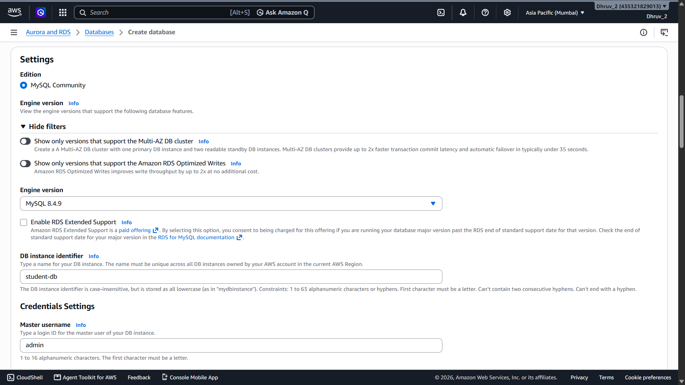

---

### 4. Master Password and Instance Configuration

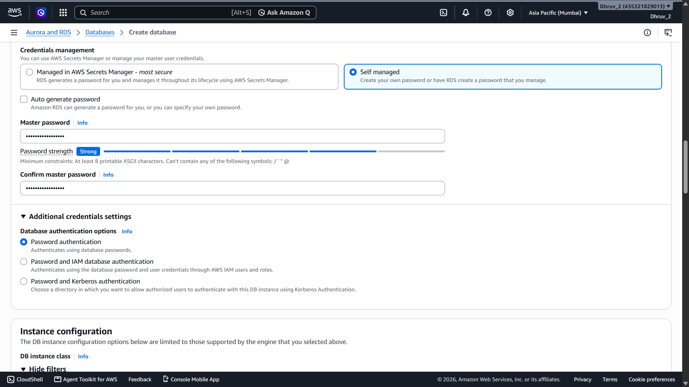

---

### 5. Instance Class and Storage Configuration

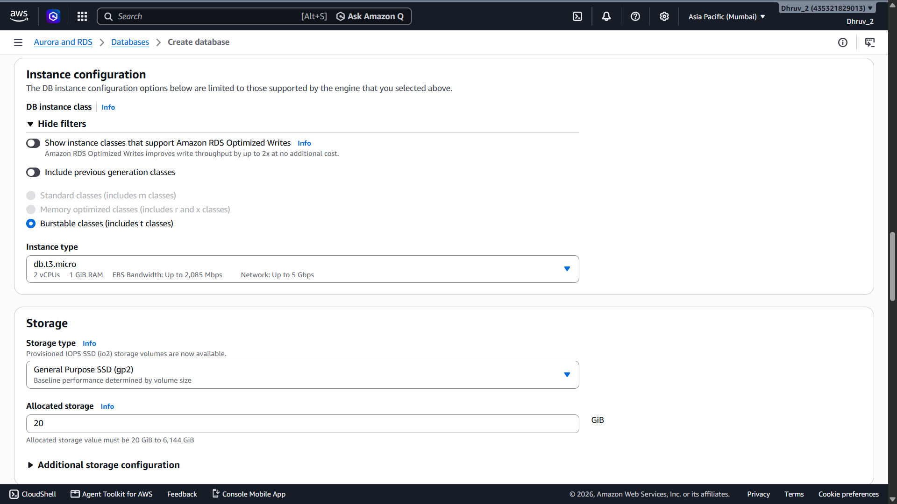

---

### 6. Connectivity and Network Configuration

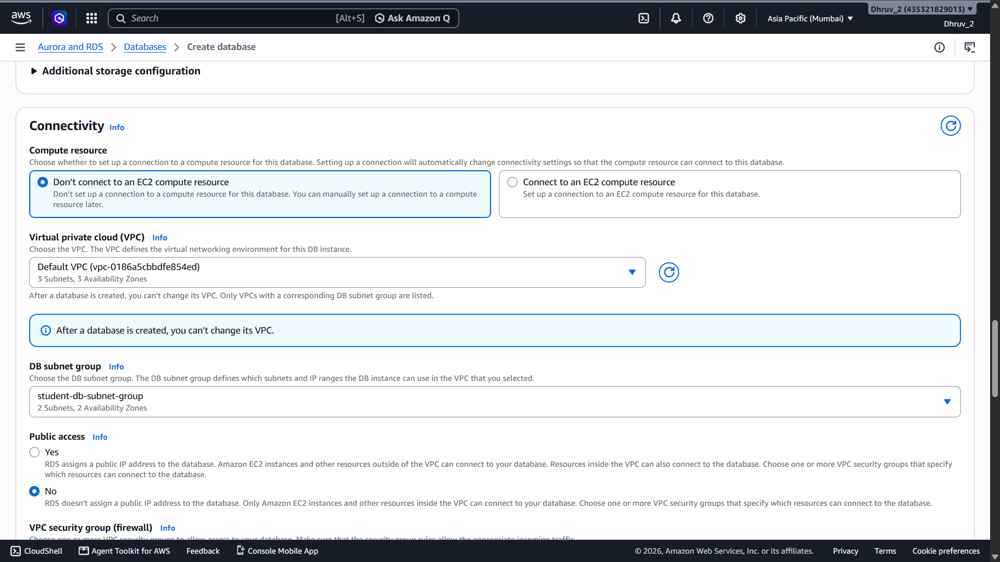

---

### 7. Security Group Configuration

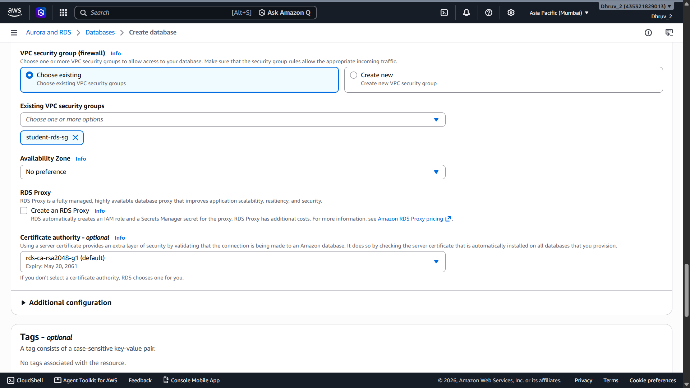

---

### 8. Monitoring Configuration

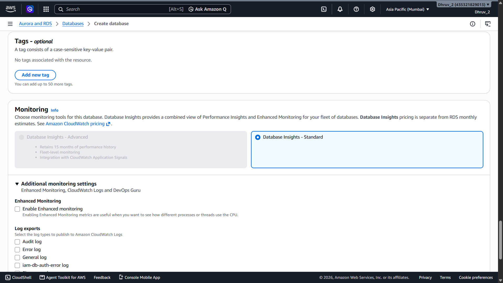

---

### 9. Final Review Before Creation

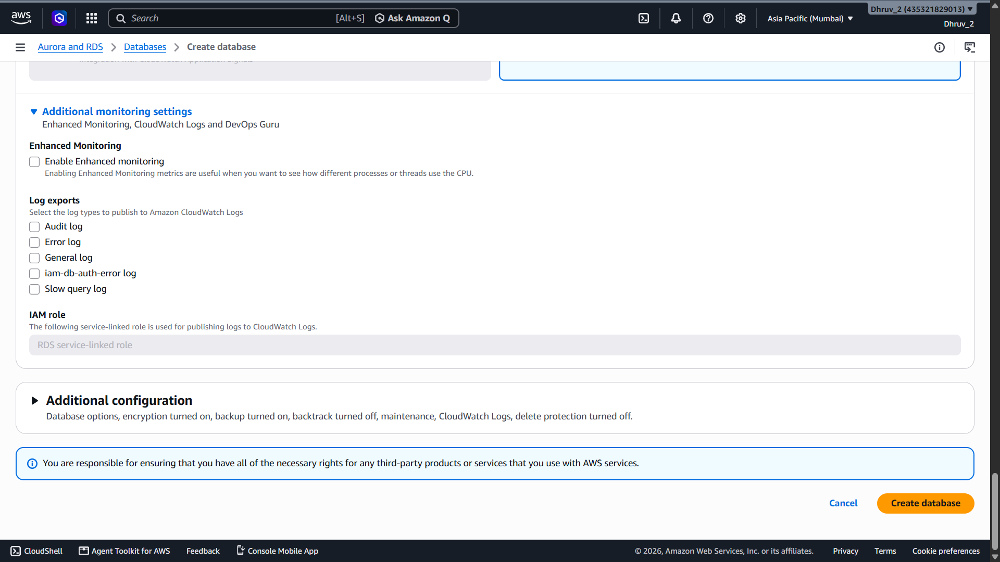

---

### 10. Database Creation in Progress

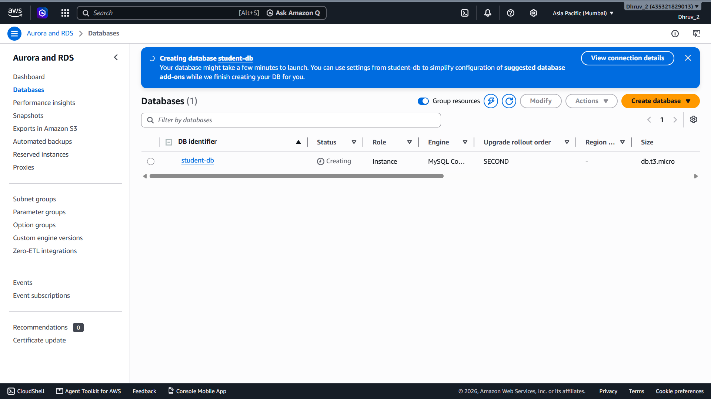

---

### 11. Database Available

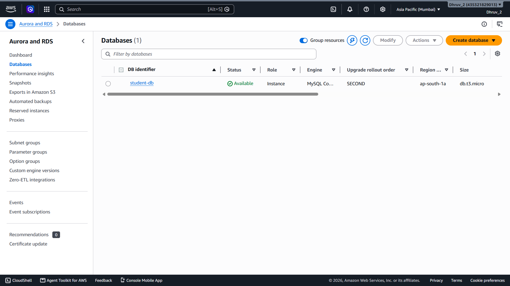

---

### 12. RDS Endpoint Details

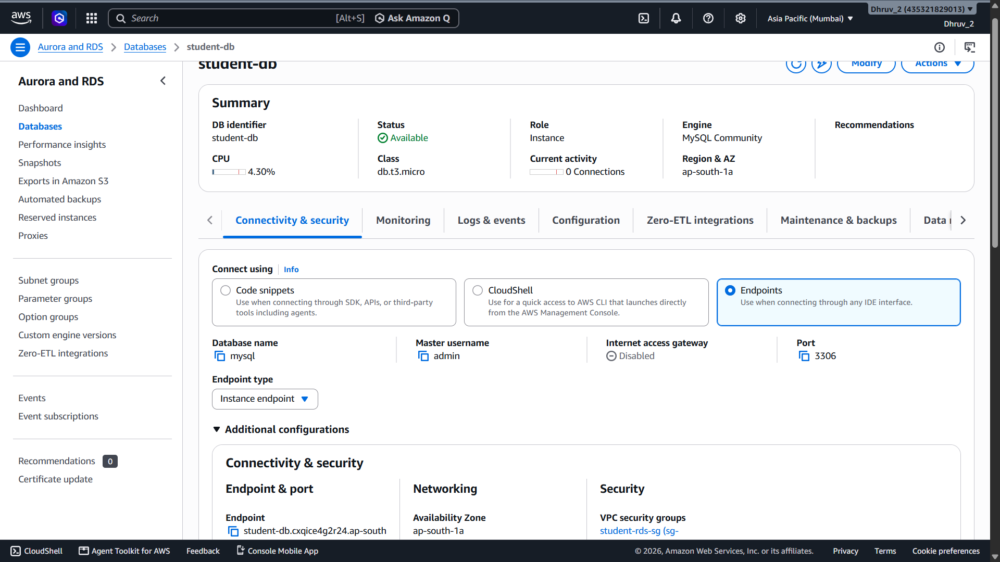

---

### 13. MySQL Client Installed on EC2

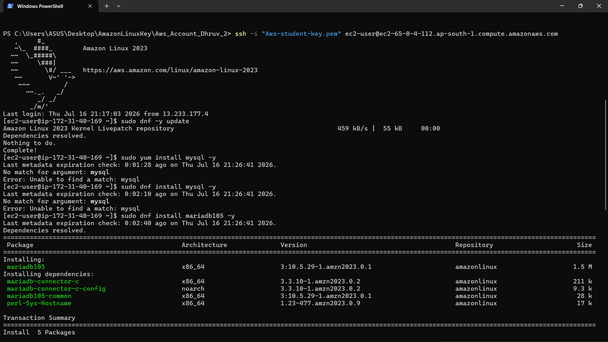

---

### 14. RDS Connection Command

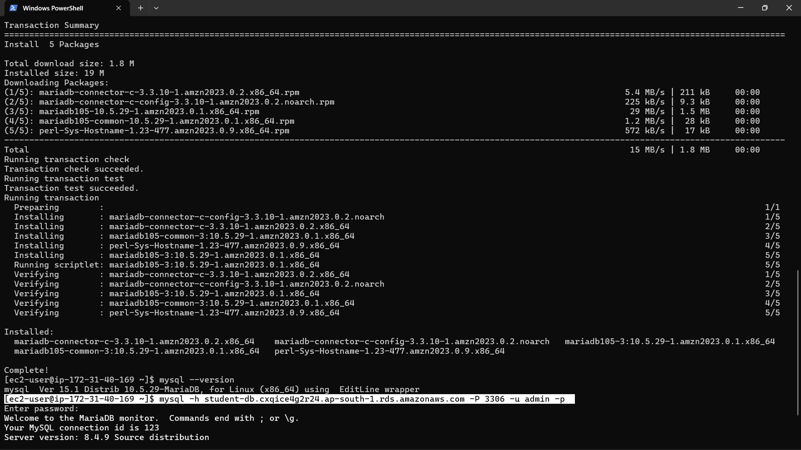

---

### 15. Successful EC2 to RDS Connection

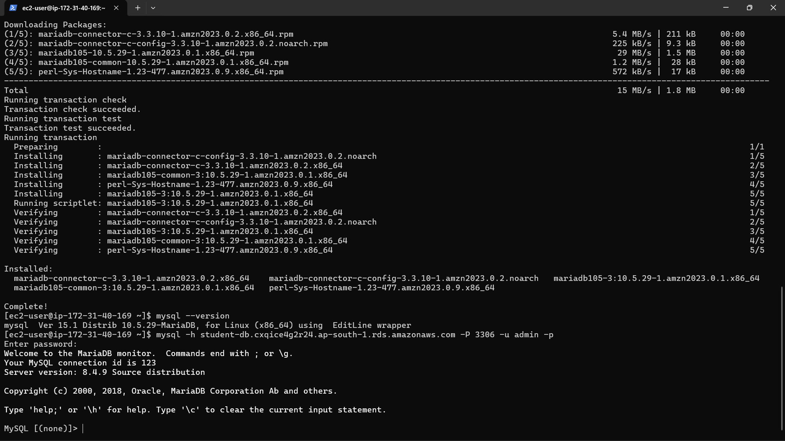

---

### 16. RDS Connectivity and Security Details

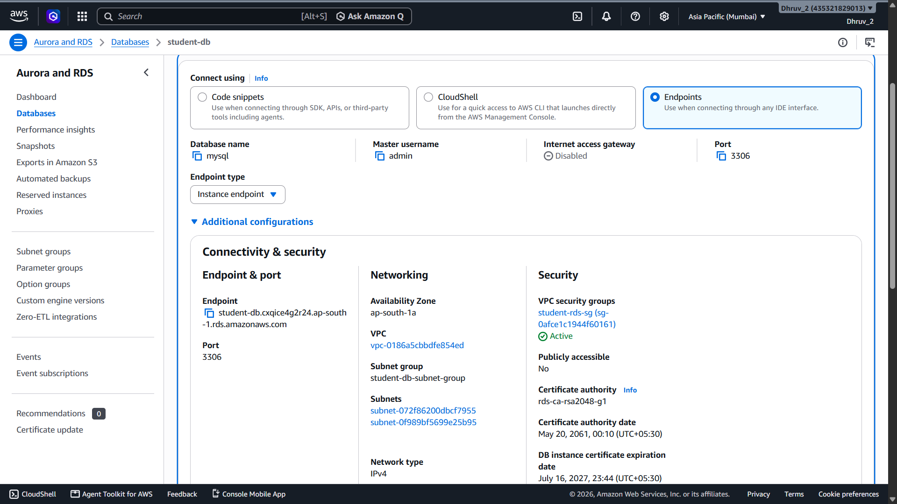
