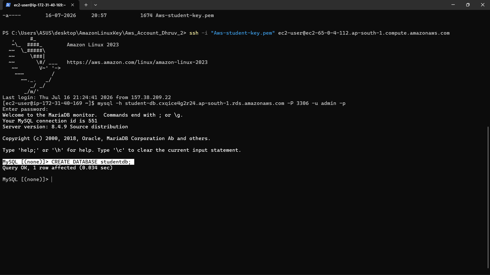
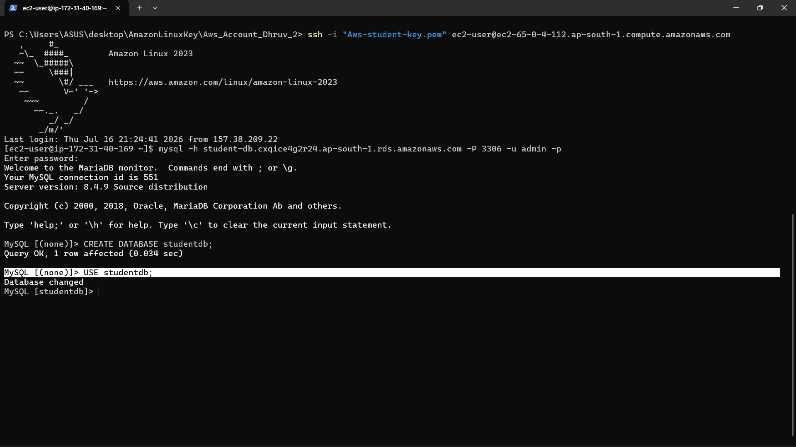
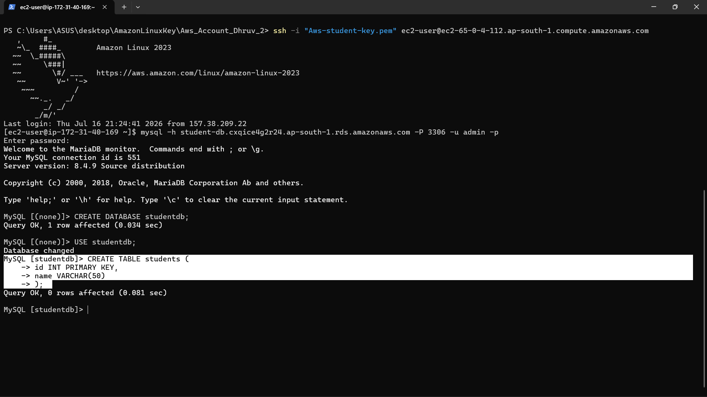
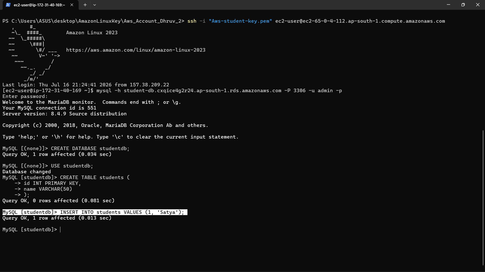
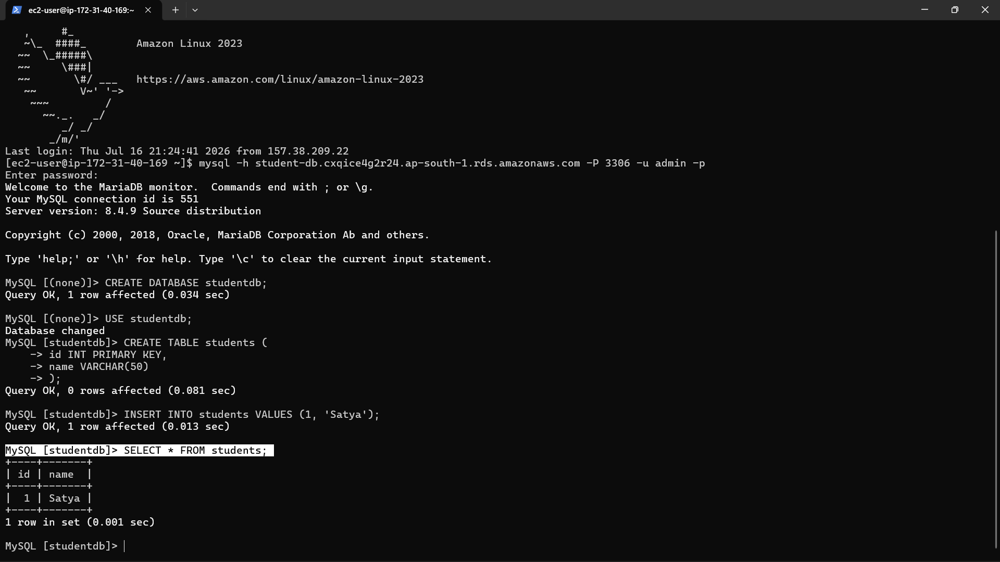

# 06 - Database Operations

## Overview

After successfully connecting the Amazon EC2 instance to the private Amazon RDS MySQL database, basic database operations were performed to verify that the connection was functioning correctly.

A new database was created, a table was defined, sample data was inserted, and the stored data was retrieved successfully. These operations confirmed that the EC2 instance can securely interact with the Amazon RDS MySQL instance.

---

## Objective

Perform basic SQL operations on the Amazon RDS MySQL instance to verify successful database connectivity and functionality.

---

## Configuration

| Setting | Value |
|----------|-------|
| Database Name | studentdb |
| Table Name | students |
| Primary Key | id |
| Primary Key Data Type | INT |
| Name Column | name |
| Name Data Type | VARCHAR(50) |
| Sample Record | (1, 'Satya') |
| SQL Client | MariaDB Client |
| Database Server | Amazon RDS MySQL |

---

## Steps Performed

1. Connected to the Amazon RDS MySQL instance from the EC2 instance.
2. Created a new database named **studentdb**.
3. Switched to the newly created database.
4. Created the **students** table.
5. Defined **id** as the Primary Key.
6. Defined **name** as a VARCHAR(50) column.
7. Inserted the first record into the table.
8. Retrieved all records using the **SELECT** statement.
9. Verified that the data was successfully stored in the Amazon RDS database.

---

## Why Database Operations are Required

After establishing connectivity between EC2 and Amazon RDS, it is important to verify that the application server can successfully interact with the database.

Performing database operations confirms:

- Successful authentication with the database.
- Proper network connectivity between EC2 and RDS.
- Correct database permissions.
- Ability to create databases and tables.
- Successful insertion and retrieval of data.
- Proper functioning of the Amazon RDS MySQL instance.

These operations validate that the complete database environment is ready for application deployment.

---

## Architecture Impact

After completing this step, the project infrastructure includes:

- Amazon EC2 Instance
- EC2 Security Group
- Amazon RDS Security Group
- Amazon RDS DB Subnet Group
- Amazon RDS MySQL Instance
- MySQL Database (**studentdb**)
- Students Table
- Sample Data Stored in Amazon RDS

The EC2 instance can now perform database operations such as creating databases, creating tables, inserting records, and querying data from the private Amazon RDS MySQL database.

---

## Screenshots

### 1. Database Created Successfully

---

### 2. Database Selected

---

### 3. Students Table Created

---

### 4. First Record Inserted

---

### 5. Data Retrieved Successfully

---

## Result

Successfully verified the complete functionality of the Amazon RDS MySQL database by performing basic SQL operations from the EC2 instance.

The following tasks were completed successfully:

- Created a new database.
- Created a relational table.
- Defined a Primary Key.
- Inserted sample data.
- Retrieved the stored data.
- Verified secure communication between EC2 and Amazon RDS.

This confirms that the EC2 instance can securely perform database operations on the private Amazon RDS MySQL instance.
